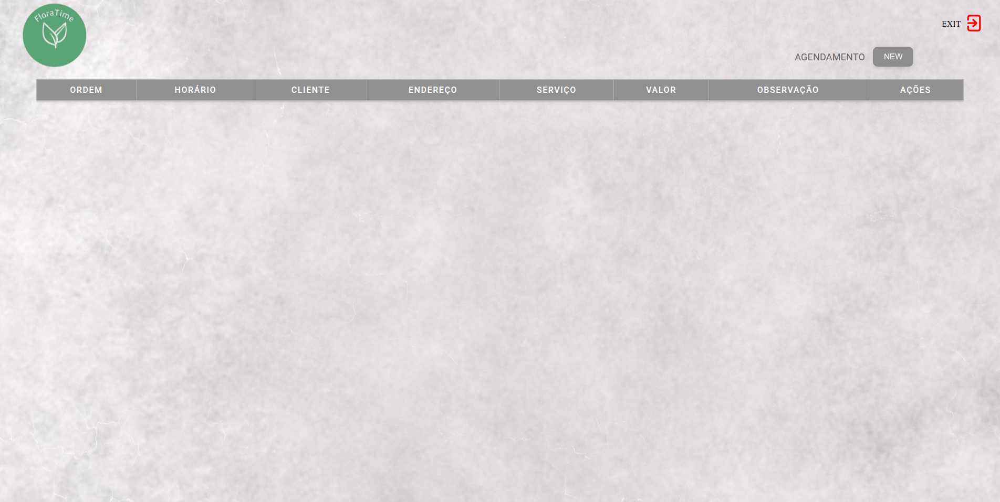
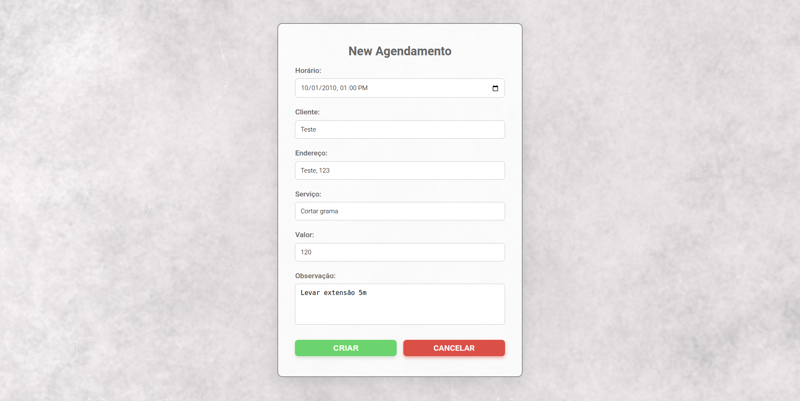
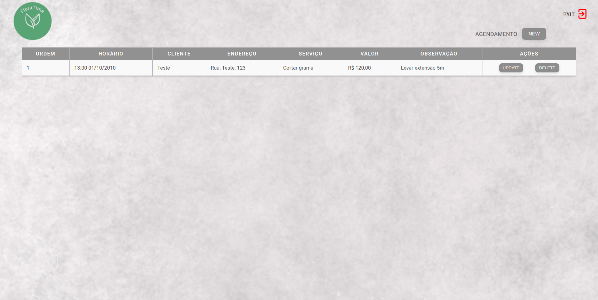
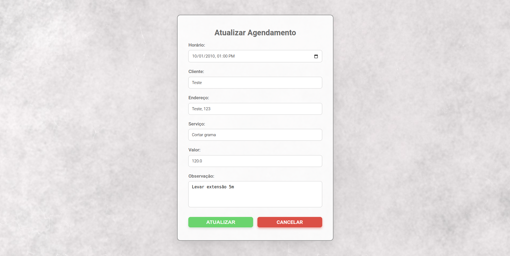
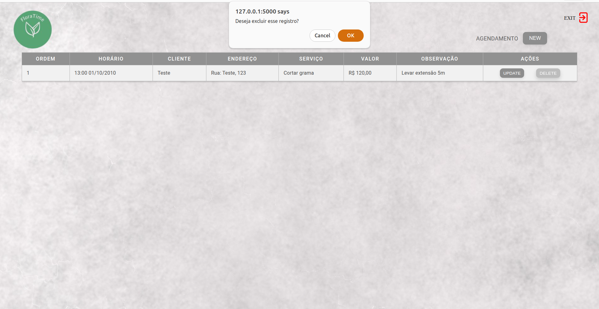

# FloraTime

FloraTime foi desenvolvido como parte de um trabalho de Engenharia de Software, com o objetivo de implementar um CRUD utilizando a arquitetura em camadas (MVC). O projeto foi concebido como um exercício de prática em desenvolvimento de software, permitindo o aprendizado de conceitos fundamentais da programação em camadas.

A escolha da finalidade do sistema foi livre, e optei por criar um sistema voltado para agendamentos de jardinagem (embora seja adaptável a outros tipos de agendamento). A ideia surgiu ao observar um jardineiro enfrentando dificuldades para organizar seus horários, o que inspirou o desenvolvimento de uma solução simples e funcional como forma de treino.

## 🛠 Tecnologias Utilizadas

- Frontend: HTML, CSS
- Backend: Flask
- Banco de Dados: SQLite

## 🏗 Estrutura do Projeto

- **.venv/**: contém o ambiente virtual do Python com todas as dependências instaladas para o projeto.  
- **controller/control.py**: implementa a lógica de controle, conectando as requisições da interface de usuário com as operações nos modelos de dados.  
- **models/**:  
  - **agend.py**: define a estrutura e as funções relacionadas ao gerenciamento de agendamentos.  
  - **banco.py**: contém a classe para operações CRUD no banco de dados SQLite.  
- **view/**:  
  - **static/**: armazena arquivos estáticos como imagens, ícones e CSS.  
  - **templates/**: diretório para os arquivos HTML renderizados pelo Flask.  
- **api.py**: arquivo principal que inicializa a aplicação Flask e define as rotas do sistema.

## 🛸 Começando

Essas instruções permitirão que você obtenha uma cópia do projeto em operação na sua máquina local para fins de desenvolvimento e teste.

## 📋 Pré-requisitos

Você irá precisar ter instalado:

- [Visual Studio Code](https://code.visualstudio.com/) (ou outro editor)

- [Linguagem Python](https://www.python.org/)

## 🔧 Instalação e Configuração

#### 1. Download do projeto

Faça o download da última Tag do projeto, depois extraía e abra com um editor.
> https://github.com/diogo-h-cost/FloraTime/tags

#### 2. Criar ambiente

Abra o terminal dentro da pasta **FloraTime-1.0** e digite:

- Linux
```
python3.10 -m venv .venv
```

❗️ A versão do python pode variar conforme a versão instalada no Linux.

- Windows
```
python -m venv .venv
```

#### 3. Ativar ambiente

No terminal:

- Linux
```
source .venv/bin/activate
```

- Windows
```
.venv\Scripts\activate
```

❗️ Fechar terminal após.

#### 4. Alterar interpretador python

Por padrão é selecionado **Global**, tem que alterar para o **.venv**, no Visual Studio Code pressione:
```
CTRL + SHIFT + P
```

Digite:
```
Python: select interpreter
```

Selecione a opção que tem ('.venv').
Ex: `Python 3.10.12('.venv')`

#### 5. Instalar pacotes

No terminal e com o ambiente (.venv) ativado:
```
pip install flask
```

🔍 Você pode listar todos os pacotes com **pip list**.

## ⚙️ Executar Projeto

#### 1. Iniciar servidor

No terminal e dentro da pasta **FloraTime-1.0** insira:
```
python api.py
```

#### 2. Navegador

Após iniciar o servidor, o sistema estará rodando em:
> http://127.0.0.1:5000

#### 3. Login

Para acessar insira:
- **User**: Admin
- **Password**: teste123


#### 4. Home

Temos os campos:
- Nº de serviço
- Horário
- Nome do cliente
- Endereço de realização
- Tipo de serviço
- Valor
- Observação

**Ações** pode ser atualizar ou deletar o registro.


🔍 Canto superior direito tem a opção de sair.

#### 5. Novo agendamento

Permite adicionar um novo registro com informações como nome do cliente, endereço, valor…



#### 6. Home

Após criar um agendamento aparece as opções de **atualizar** ou **deletar** o registro (agendamento).



#### 7. Update

Ao clicar no botão update do registro, abre um formulário pré-preenchido para editar dados de um registro.



#### 8. Delete

Ao clicar no botão delete irá remover o registro selecionado permanentemente do banco de dados.



## 📍 Parar Projeto

#### 1. Parar servidor

No terminal pressione:
```
CTRL + C
```

#### 2. Desativar ambiente

- Linux / Windows
```
deactivate
```

❗️ Fechar terminal após.

🔍 Pode deletar o .venv e o banco caso queira.

#### 3. Alterar interpretador python

Voltar para o padrão **Global**, no Visual Studio Code pressione:
```
CTRL + SHIFT + P
```

Digite:
```
Python: select interpreter
```

Selecione a opção com **Global**.

## 📌 Versão

Para as versões disponíveis, observe as [tags neste repositório](https://github.com/diogo-h-cost/FloraTime/tags).

## ✒️ Autores

- [**Diogo Lima**](https://github.com/diogo-h-cost)

## 📄 Licença de Uso Acadêmico - FloraTime

**Copyright © 2025 Diogo Lima**

Este software foi desenvolvido para fins educacionais como parte de um projeto acadêmico e é propriedade do autor.

**Permissões:**
- Uso pessoal e educacional é permitido.
- A visualização do código-fonte é permitida.

**Restrições:**
- Não é permitido modificar, redistribuir ou utilizar o software para fins comerciais sem autorização prévia por escrito do autor.
- Qualquer tentativa de remover os direitos autorais será considerada uma violação dos termos desta licença.

**Garantias:**
Este software é fornecido “como esta”, sem garantias de qualquer tipo, explícitas ou implícitas, incluindo, mas não se limitando a, garantias de comercialização ou adequação a um propósito específico. O autor não será responsável por quaisquer danos ou prejuízos decorrentes do uso deste software.

🔍 Para dúvidas ou permissões especiais, entre em contato.