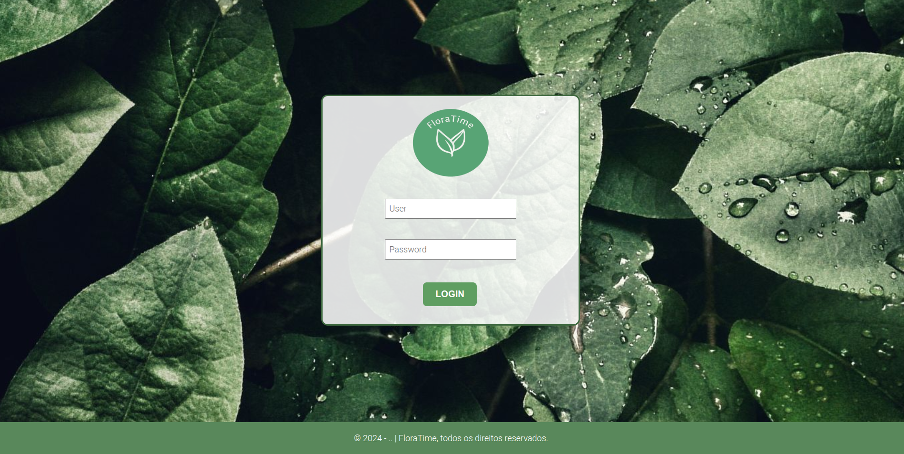

## FloraTime
Sistema de agendamento de horários para jardinagem.

FloraTime foi desenvolvido como parte de um trabalho de Engenharia de Software, com o objetivo de implementar um CRUD utilizando a arquitetura em camadas (MVC). O projeto foi concebido como um exercício de prática em desenvolvimento de software, permitindo o aprendizado de conceitos fundamentais da programação em camadas.

A escolha da finalidade do sistema foi livre, e optei por criar um sistema voltado para agendamentos de jardinagem (embora seja adaptável a outros tipos de agendamento). A ideia surgiu ao observar um jardineiro enfrentando dificuldades para organizar seus horários, o que inspirou o desenvolvimento de uma solução simples e funcional como forma de treino.

## 🛠 Tecnologias utilizadas

- Frontend: HTML, CSS
- Backend: Flask
- Banco de Dados: SQLite

## Estrutura do projeto

aa

## 🛸 Começando

Essas instruções permitirão que você obtenha uma cópia do projeto em operação na sua máquina local para fins de desenvolvimento e teste.

## 📋 Pré-requisitos

Você irá precisar ter instalado:

- [Visual Studio Code](https://code.visualstudio.com/) (ou outro editor)

- [Linguagem Python](https://www.python.org/)

## 🔧 Instalação e configuração

#### 1. Download do projeto

Faça o download da última Tag do projeto, depois extraía e abra com um editor.
> https://github.com/diogo-h-cost/FloraTime/tags

##### 2. Criar o ambiente

Abra o terminal dentro da pasta **FloraTime-1.0** e digite:

- Linux
> python3.10 -m venv .venv

❗️ A versão do python pode variar conforme a versão instalada no linux.

- Windows
> python -m venv .venv

 

##### 3. Ativar o ambiente

No terminal:

- Linux
> source .venv/bin/activate

- Windows
> .venv\Scripts\activate

❗️ Fechar terminal após.

 

##### 4. Alterar interpretador python

Por padrão é selecionado **Global**, tem que alterar para o **.venv**, no Visual Studio Code precione:
> CTRL + SHIFT + P

Digite:
> Python: select interpreter

Selecione a opção que tem ('.venv')
Ex: `Python 3.10.12('.venv')`

 

##### 5. Instalar pacotes

No terminal e com o ambiente (.venv) ativado:

> pip install flask

🔍 Você pode listar todos pacotes com **pip list**

---

### ⚙️ Execultar projeto

 

##### 1. Iniciar servidor

No terminal e dentro da pasta **FloraTime-1.0** insira:
> python api.py

 

##### 2. Navegador

Após iniciar o servidor, o sistema estará rodando em:
> http://127.0.0.1:5000

 

##### 3. Login

Para acessar insira:
- **User**: Admin
- **Password**: teste123

 

##### 4. Home

Temos os campos:
- Nº de serviço
- Horário
- Nome do cliente
- Endereço de realização
- Tipo de serviço
- Valor
- Observação

**Ações** pode ser atualizar ou deletar o registro

🔍 Canto superior direito tem a opção de sair.

 

##### 5. Novo agendamento

 

##### 6. Home

Após criar um agendamento aparece as opções de **atualizar** ou **deletar** o registro (agendamento).

 

##### 7. Update

Ao clicar no botão update do registro, direciona para outra tela com os campos preenchidos para serem atualizados.

 

##### 8. Delete

Ao clicar no botão delete do registro, exclui o mesmo do banco de dados.

---

### 📍 Parar projeto

 

##### 1. Parar servidor

No terminal pressione:
> CTRL + C

 

##### 2. Desativar ambiente

- Linux / Windows
> deactivate

❗️ Fechar terminal após.

🔍 Pode deletar o .venv e o banco caso queira.

 

##### 3. Alterar interpretador python

Voltar para o padrão **Global**, no Visual Studio Code precione:
> CTRL + SHIFT + P

Digite:
> Python: select interpreter

Selecione a opção que tem **Global**

---

### 📌 Versão

Para as versões disponíveis, observe as [tags neste repositório](https://github.com/diogo-h-cost/FloraTime/tags).

Falta colocar a estrutura e mais....